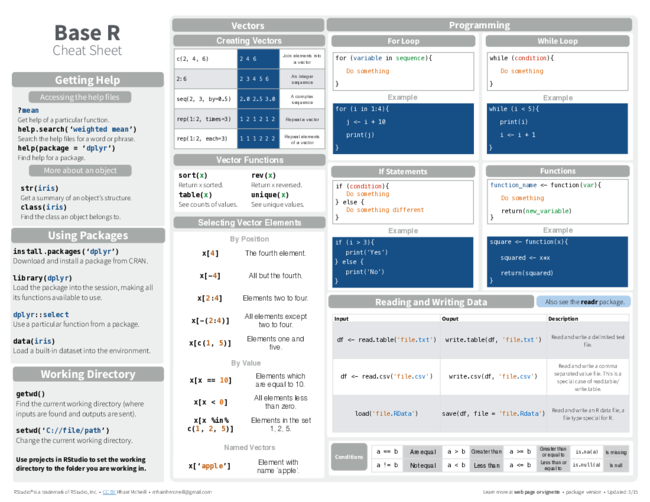
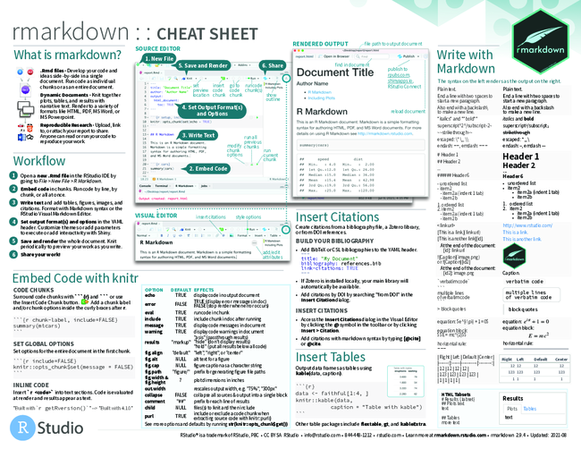

```{r setup, include=FALSE}
knitr::opts_chunk$set(echo = TRUE)
```

Course
--------------

<https://pcinereus.github.io/SUYRs_documents/>

<https://pcinereus.github.io/SUYRs_public/>

<https://github.com/pcinereus/SUYRs_public/>

<!--<http://www.flutterbys.com.au/stats>-->

<http://r4ds.had.co.nz/>

Topics
-------

+-----+--------------------------------------------------------------------------+
| Day | Topic                                                                    |
+=====+==========================================================================+
| 1   | Intro to Version control (git), reproducible research (quarto)           |
|     | and AI assisted coding setting up environment                            |
+-----+--------------------------------------------------------------------------+
|   2 | Introduction to Bayesian analyses and (generalized) linear models (GLM)  |
+-----+--------------------------------------------------------------------------+
|   3 | Day 2 continued - Bayesian GLM continued                                 |
+-----+--------------------------------------------------------------------------+
|   4 | Day 3 continued - Bayesian GLM continued                                 |
+-----+--------------------------------------------------------------------------+
|   5 | Bayesian generalized linear mixed effects models (GLMM)                  |
+-----+--------------------------------------------------------------------------+
|   6 | Day 5 continued - Bayesian GLMM                                          |
+-----+--------------------------------------------------------------------------+
|   7 | Day 6 continued - Bayesian GLMM                                          |
+-----+--------------------------------------------------------------------------+
|   8 | Bayesian generalized additive models (GAM + GAMM)                        |
+-----+--------------------------------------------------------------------------+
|   9 | Regression trees                                                         |
+-----+--------------------------------------------------------------------------+
|  10 | Multivariate analyses                                                    |
+-----+--------------------------------------------------------------------------+
: {.striped .hover .sketch-table}

Preparations
------------------

- Show-us-your-Rs
  - [webpage](https://pcinereus.github.io/SUYRs_documents/)

- R editors
  - Rstudio
  - Positron

- Version control / Collaboration
  - git/github

Preparations
------------------

- Scripts and reproducible research
  - knitr
  - lintr/styler
  - Quarto

Cheat sheets (ref cards) {.smaller}
--------------------------

<https://www.rstudio.com/resources/cheatsheets/>


R {.smaller}
--------------------

<https://github.com/rstudio/cheatsheets/raw/master/base-r.pdf>

```{r base-r, cache=TRUE,echo=FALSE}
system("convert -resize 650x ../resources/base-r.pdf ../resources/base-r.png")
system("mv ../resources/base-r-0.png ../resources/base-r.png")
```




R studio {.smaller}
--------------------

<https://github.com/rstudio/cheatsheets/raw/master/rstudio-ide.pdf>

```{r rstudio-ide, cache=TRUE,echo=FALSE}
system("convert -resize 650x ../resources/rstudio-ide.pdf ../resources/rstudio-ide.png")
system("mv ../resources/rstudio-ide-0.png ../resources/rstudio-ide.png")
```


R studio {.fragment}
--------------------

- browser IDE
- integrates with R, git, bash etc

<br>

### Important considerations

- Rstudio is not R
- **Avoid** installing packages via RStudio
- Learn to use **Keybindings**: Cntl-Shift-K
- Use **snippets** (Tools -> Edit Code Snippets)

Packages
----------

- extend functionality

. . .

- installing from CRAN

::: {.callout-important}
Be very careful doing this within an RStudio session
:::


```{r installing, results='markdown', eval=FALSE}
install.packages("tidyverse")
```

. . .


- installing from github
```{r installing-gh, results='markdown', eval=FALSE}
removes::install_github("jmgirard/standist")
```
. . .

- loading
```{r}
#| label: library
#| eval: true
#| warnings: true
#| messages: true
library("tidyverse")
```

Packages - Option 1
----------

```{r}
#| label: library1a
#| eval: false
#| code-line-numbers: "|8-10"
install.packages("car")         # for regression diagnostics
install.packages("ggfortify")   # for model diagnostics
install.packages("DHARMa")      # for model diagnostics
install.packages("see")         # for model diagnostics
install.packages("lindia")      # for diagnostics of lm and glm
install.packages("broom")       # for consistent, tidy outputs
install.packages("knitr")       # for knitting documents and code
install.packages("glmmTMB")     # for model fitting
install.packages("effects")     # for partial effects plots
install.packages("ggeffects")   # for partial effects plots
install.packages("emmeans")     # for estimating marginal means
install.packages("modelr")      # for auxillary modelling functions
install.packages("performance") # for model diagnostics
install.packages("datawizard")  # for data properties
install.packages("insight")     # for model information
install.packages("sjPlot")      # for outputs
```

Packages - Option 1
----------

```{r library1b, results='markdown', eval=FALSE}
install.packages("report")      # for reporting methods/results
install.packages("easystats")   # framework for stats, modelling and visualisation
install.packages("MuMIn")       # for AIC and model selection
install.packages("MASS")        # for old modelling routines
install.packages("patchwork")   # for combining multiple plots together
install.packages("gam")         # for GAM(M)s
install.packages("gratia")      # for GAM(M) plots
install.packages("modelbased")  # for model info
install.packages("broom.mixed") # for tidy outputs from mixed models
```

Packages - Option 2
----------

```{r library1a2, results='markdown', eval=FALSE}
install.packages("car")         # for regression diagnostics
install.packages("ggfortify")   # for model diagnostics
install.packages("DHARMa")      # for model diagnostics
install.packages("see")         # for model diagnostics
install.packages("broom")       # for consistent, tidy outputs
install.packages("knitr")       # for knitting documents and code
install.packages("glmmTMB")     # for model fitting
install.packages("effects")     # for partial effects plots
install.packages("ggeffects")   # for partial effects plots
install.packages("emmeans")     # for estimating marginal means
install.packages("modelr")      # for auxillary modelling functions
install.packages("performance") # for model diagnostics
install.packages("datawizard")  # for data properties
install.packages("insight")     # for model information
install.packages("sjPlot")      # for outputs
```

Packages - Option 2
----------

```{r library1b2, results='markdown', eval=FALSE}
install.packages("report")      # for reporting methods/results
install.packages("easystats")   # framework for stats, modelling and visualisation
install.packages("patchwork")   # for combining multiple plots together
install.packages("modelbased")  # for model info
install.packages("broom.mixed") # for tidy outputs from mixed models
install.packages("tidybayes")   # for tidy outputs from mixed models
```

and then there is `cmdstan` or `rstan` and `brms`

- [005_setup.html](https://pcinereus.github.io/SUYRs_documents/005_setup.html)
- [cmdstanr](https://mc-stan.org/cmdstanr/articles/cmdstanr.html)
- [install-brms](https://learnb4ss.github.io/learnB4SS/articles/install-brms.html)


Packages
----------

- **namespaces**
```{r namespaces, results='markdown', eval=FALSE}
stats::filter()
dplyr::filter()
```
. . .

- **polymorphism** (functional overloading)
```{r polymorphism, results='markdown', eval=TRUE}
mean
```
. . .

```{r polymorphism1, results='markdown', eval=TRUE}
```
base:::mean.default


Reproducible research {.smaller}
-----------------------

- install `knitr` and `quarto` packages
- **Quarto** - modification of R markdown

<https://github.com/rstudio/cheatsheets/raw/master/rmarkdown-2.0.pdf>

```{r rmarkdown, cache=FALSE, echo=FALSE}
system("convert -resize 650x ../resources/rmarkdown.pdf ../resources/rmarkdown.png")
system("mv ../resources/rmarkdown-0.png ../resources/rmarkdown.png")
```




R revision and updates
------------------------------------

- functions

. . .

- pipes (`|>`)

. . .

- snippets

````{snippets}
snippet r
```{r}
#| label: ${1}
#| eval: true
${0}
```
````

. . .

- AI tools
