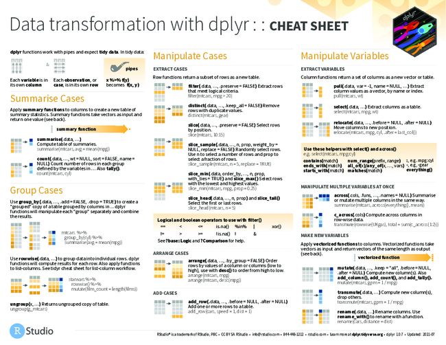
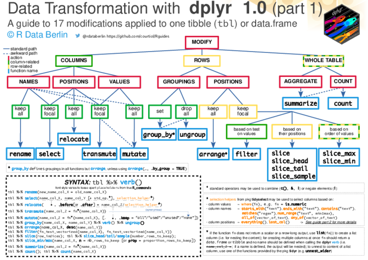
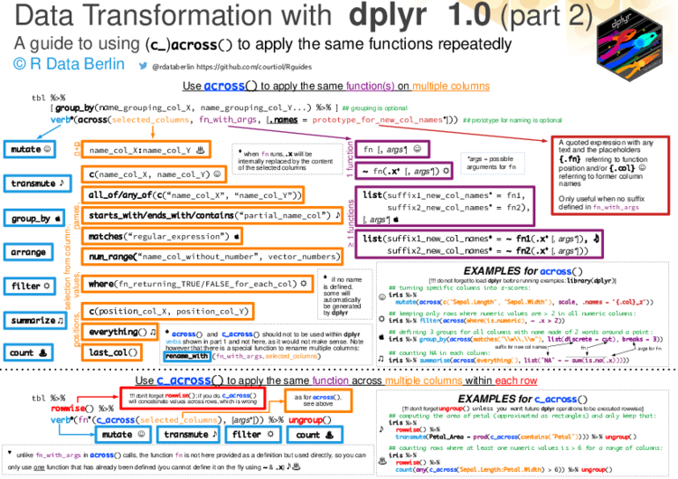
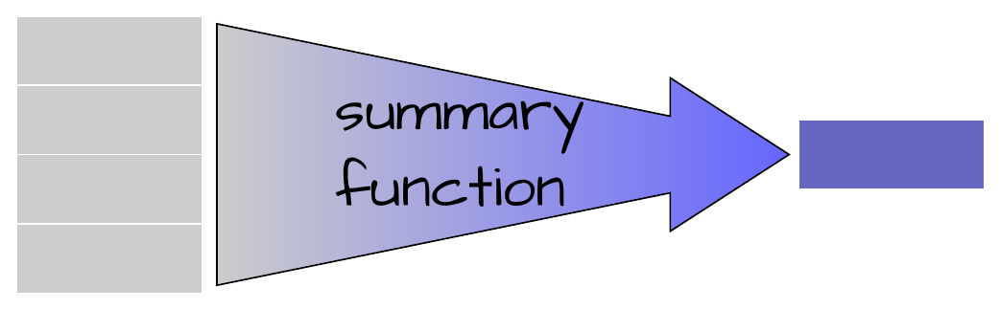
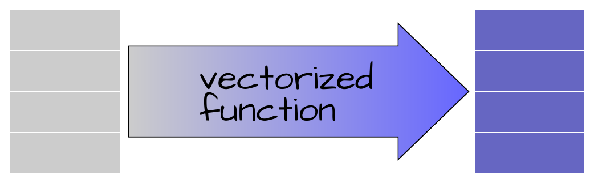
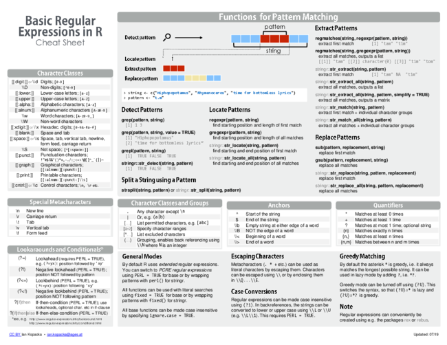

```{r setup, include=FALSE}
knitr::opts_chunk$set(echo = TRUE, warning = FALSE, message = FALSE)
options(tinytex.engine = "xelatex")
```

Motivating data
-----------------------------

::: {.columns}
:::: {.column width="60%"}

```{r}
#| label: loadData
#| results: markup
#| eval: false
#| echo: true
#| cache: false
load(file = "../data/manipulationDatasets.RData")
```

```{r}
#| label: loadData1
#| results: markup
#| eval: true
#| echo: false
#| cache: false
load(file = "../data/manipulationDatasets.RData")
```

```{tikz}
%| label: tikz_fab_data
%| engine: tikz
%| echo: false
%| fig-width: 6
%| fig-height: 6
%| out-height: 150px
%| cache: true
%| class: tikz
%| engine-opts:
%|   template: "../resources/tikz-minimal.tex"
\tikzstyle{Title} = [font={\fontspec[Scale=2]{Complete in Him}}]
\tikzstyle{code} = [font=\ttfamily]
\tikzstyle{Messy} = [decorate,decoration={random steps,segment length=3pt, amplitude=0.3pt},thick]
\begin{tikzpicture}

\coordinate (A) at (0,0);

\begin{scope}[local bounding box=P1a,anchor=north west, shift=(A),on background layer]
\node [draw, minimum width=1cm, minimum height=1cm, Title, Messy] (P1D1) {H};
\node [draw, minimum width=1cm, minimum height=1cm, anchor=north west, Title, Messy] at ($(P1D1.south east) +(0.2,0)$) (P1D2) {M};
\node [draw, minimum width=1cm, minimum height=1cm, anchor=south west, Title, Messy] at ($(P1D2.north east) +(0.2,0)$) (P1D3) {L};
\end{scope}
\begin{scope}[on background layer]
\node [fit={(P1D1) (P1D2) (P1D3)}, draw, pattern = grid, pattern color=blue, opacity=0.2, Messy, thick] (P1) {};
\draw [Messy, thick] (P1.north west) -- (P1.south west) -- (P1.south east) -- (P1.north east) -- cycle;
\end{scope}

\begin{scope}[anchor=north, shift=(P1D3.south), yshift=-1.5cm, xshift=-2.5cm]
\node [draw, Title, Messy] (T1) {T1};
\node [draw, anchor=north west, xshift=0.15cm, Title, Messy] at (T1.north east) (T2) {T2};
\node [draw, anchor=north west, xshift=0.15cm, Title, Messy] at (T2.north east) (T3) {T3};
\node [draw, anchor=north west, xshift=0.15cm, Title, Messy] at (T3.north east) (T4) {T4};
\draw [latex-,Messy] (T1) -- (P1D2);
\draw [latex-,Messy] (T2) -- (P1D2);
\draw [latex-,Messy] (T3) -- (P1D2);
\draw [latex-,Messy] (T4) -- (P1D2);
\draw [Messy] (T1.south) -- ($(T1.south) +(0,-1)$);
\draw ($(T1.south) +(0,-0.5)$) -- ($(T1.south) +(0.5,-0.5)$) node [anchor=west, code]{Resp1};
\draw ($(T1.south) +(0,-1)$) -- ($(T1.south) +(0.5,-1)$) node [anchor=west, code]{Resp2};
\end{scope}

\begin{scope}[local bounding box=P2a, anchor=north west, shift=(P1a.north east), xshift=1cm]
\node [draw, minimum width=1cm, minimum height=1cm, Title, Messy] (P2D1) {L};
\node [draw, minimum width=1cm, minimum height=1cm, anchor=north west, Title, Messy] at ($(P2D1.south east) + (0.2,0)$) (P2D2) {H};
\node [draw, minimum width=1cm, minimum height=1cm, anchor=south west, Title, Messy] at ($(P2D2.north east) + (0.2,0)$) (P2D3) {M};
\end{scope}
\begin{scope}[on background layer]
\node [fit={(P2D1) (P2D2) (P2D3)}, draw, thick, Messy]  (P2) {};
\end{scope}

\begin{scope}[local bounding box=P3a, anchor=north west, shift=(P2a.north east), xshift=1cm]
\node [draw, minimum width=1cm, minimum height=1cm, Title, Messy] (P3D1) {M};
\node [draw, minimum width=1cm, minimum height=1cm, Title, anchor=north west, Messy] at ($(P3D1.south east) + (0.2,0)$) (P3D2) {H};
\node [draw, minimum width=1cm, minimum height=1cm, Title, anchor=south west, Messy] at ($(P3D2.north east) + (0.2,0)$) (P3D3) {L};
\end{scope}
\begin{scope}[on background layer]
\node [fit={(P3D1) (P3D2) (P3D3)}, draw, pattern = grid, pattern color=blue, opacity=0.2, Messy, thick]  (P3) {};
\draw [Messy, thick] (P3.north west) -- (P3.south west) -- (P3.south east) -- (P3.north east) -- cycle;
\end{scope}

\begin{scope}[local bounding box=P4a, anchor=north west, shift=(P3a.north east), xshift=1cm]
\node [draw, minimum width=1cm, minimum height=1cm, Title, Messy] (P4D1) {L};
\node [draw, minimum width=1cm, minimum height=1cm, Title, anchor=north west, Messy] at ($(P4D1.south east) +(0.2,0)$) (P4D2) {M};
\node [draw, minimum width=1cm, minimum height=1cm, Title, anchor= west, Messy] at ($(P4D2.north east) +(0.2,0)$) (P4D3) {H};
\end{scope}
\node [fit={(P4D1) (P4D2) (P4D3)}, draw, Messy, thick]  (P4) {};


\end{tikzpicture}
```

::::
:::: {.column width="40%"}
`dat.1`

```{r}
#| label: data.1
#| results: asis
#| eval: true
#| echo: false
#| cache: false
#| classes: simple-table
library(pander)
library(tidyverse)
set.seed(1)
dat.1 <- expand.grid(Time = 1:4, Dose=c("H", "M", "L"), Plot = paste0("P", 1:4)) %>%
    mutate(Dose = factor(as.character(Dose)),
           Treatment = gl(2, 24, 48, lab=c("Control", "Exclusion")),
           ## Time=rep(1:4, 3),
           M1 = ifelse(Treatment == "Control", 1, 2),
           M2 = ifelse(Dose == "H", 1, ifelse(Dose == "M", 2, 3)),
           Resp1 = round(rnorm(n(), (10 * M1) * M2 * Time, 3), 2),
           Resp2 = round(rnorm(n(), (rnorm(n(), 10, 5) * M1) * M2 * Time, 5), 2)) %>%
    dplyr::select(Treatment, Plot, Dose, Time, Resp1, Resp2)


data.1 <- expand.grid(Cond = c("H", "M", "L"), Plot = paste("P", 1:4, sep = ""))
data.1$Cond <- factor(as.character(data.1$Cond))
data.1$Between <- gl(2, 6, 12, lab = paste("A", 1:2, sep = ""))
data.1$Time <- rep(1:4, 3)
data.1 <- data.1 %>%
    group_by(Between) %>%
    mutate(LAT = rnorm(1, 18.5, 5)) %>%
    group_by(Between, Plot) %>%
    mutate(LAT = LAT + rnorm(3, 0, 0.5)) %>% ungroup
data.1 <- data.1 %>% mutate(Temp = 22 + rnorm(12, 18.5 - LAT, 0.2))
#data.1$Temp <- rnorm(12,22,10)
#data.1$LAT <- rnorm(12,18.5,2)
data.1$LONG <- rnorm(12, 145, 2)
data.1 <- dplyr::select(data.1, Between, Plot, Cond, Time, Temp, LAT, LONG)
## xTab<-xtable(data.1)
## align(xTab)<-rep("middle",6)
## print(xTab,type="html",include.rownames=F,only.contents=F,
##            include.colnames=T,sanitize.rownames.function=function(x) paste('<b>',x,'</b>'),
##      html.table.attributes=list("border='3' cellpadding='2' cellspacing='0' class='plainTable' style='font-size:50%;'")
##       )

## pandoc.table(dat.1)
knitr::kable(dat.1, format = "html", table.attr = 'class="sketch-table"')
## save(data, dat.1, data.1, data.bio,  data.chem,  data.geo, data.w,  nasa,  tikus, file='../public/data/manipulationDatasets.RData')
##save(data.1, file='../public/data/manipulationDatasets.RData')
```


::::
:::

Data manipulation
------------------

- base R syntax provides ways to manipulate and access a variety of data structures
- code can be **difficult to read and keep organised**
- exacerbated for **grouped data**

```{r data.1, echo=FALSE, results='asis'}
```

Base R
------------------

Specifying variables is cumbersome

`data[,]`

:::: {.columns style="display:flex; justify-content:space-evenly;"}

::: {.column width='45%'}
Single variable<br>
```{r, eval=FALSE}
dat.1$Resp1
dat.1[,'Var1']
dat.1[,5]
```
:::

::: {.column width='45%'}
Multiple variables<br>
```{r, eval=FALSE}
dat.1[,c("Resp1", "Resp2")]
dat.1[,5:6]
```
:::

::::

:::: {.columns style="display:flex; justify-content:space-evenly;"}

::: {.column width='45%'}
Specific rows<br>
```{r, eval=FALSE}
dat.1[c(1:4, 13:16, 25:28, 37:40),]
```
:::

::: {.column width='45%'}
Sorting<br>
```{r, eval=FALSE}
dat.1[order(dat.1$Dose), ]
```
:::

::::


:::: {.columns style="display:flex; justify-content:space-evenly;"}

::: {.column width='45%'}
Filtering<br>
```{r, eval=FALSE}
dat.1[dat.1$Dose == 'H', ]
```
:::

::: {.column width='45%'}
Aggregating<br>
```{r, eval=FALSE}
tapply(dat.1$Resp1,dat.1$Dose, mean)
```
:::

::::

Data manipulation
------------------

- enter the **tidyverse** ecosystem
- a coherent set of manipulation focussed packages

Data manipulation {.smaller}
-------------------

[github version](https://github.com/rstudio/cheatsheets/raw/master/data-transformation.pdf)

[local repo version of data-transformation.pdf](../resources/data-transformation.pdf)

```{r data-transformation, cache=TRUE,echo=FALSE}
system("convert -resize 650x ../docs/resources/data-transformation.pdf ../docs/resources/data-transformation.png")
system("mv ../public/resources/data-transformation-0.png ../public/resources/data-transformation.png")
```



Data manipulation {.smaller}
-------------------

[github version](https://github.com/courtiol/Rguides/blob/master/pdfs/dplyr_guide_for_one_table_part1.pdf)

[local repo version of dplyr guide for one table part1](../resources/dplyr_guide_for_one_table_part1.pdf)

```{r plyr_guide, cache=TRUE,echo=FALSE}
system("convert -resize 750x ../resources/dplyr_guide_for_one_table_part1.pdf ../resources/dplyr_guide_for_one_table_part1.png")
## system("mv ../resources/dplyr_guide_for_one_table_part1.png ../public/resources/dplyr_guide_for_one_table_part1.png")
```



Data manipulation {.smaller}
-------------------

[github version](https://github.com/courtiol/Rguides/blob/master/pdfs/dplyr_guide_for_one_table_part2.pdf)

[local repo version of dplyr guide for one table part2](../resources/dplyr_guide_for_one_table_part2.pdf)

```{r plyr_guide2, cache=TRUE,echo=FALSE}
system("convert -resize 750x ../resources/dplyr_guide_for_one_table_part2.pdf ../resources/dplyr_guide_for_one_table_part2.png")
## system("mv ../docs/resources/dplyr_guide_for_one_table_part2.png ../public/resources/dplyr_guide_for_one_table_part2.png")
```



Manipulation functions (verbs) {.build}
----------------------------------------

Operating on a single dataset

- operating on the rows

| Function           | Action                                |
|--------------------|---------------------------------------|
| `dplyr::arrange()` | changing the order of rows            |
| `dplyr::filter()`  | subset of rows based on column values |
| `dplyr::slice()`   | subset of rows based on position      |

: {.striped .hover .sketch-table}

Manipulation functions (verbs) {.build}
----------------------------------------

Operating on a single dataset

- operating on the columns

| Function             | Action                                           |
|----------------------|--------------------------------------------------|
| `dplyr::select()`    | subset of columns                                |
| `dplyr::rename()`    | change the name of columns                       |
| `dplyr::pull()`      | extract a single column as a vector              |
| `dplyr::distinct()`  | unique combinations of column values             |
| `dplyr::mutate()`    | adding columns and modifying column values       |
| `tidyr::unite()`     | combine multiple columns together                |
| `tidyr::separate()`  | separating a single column into multiple columns |

: {.striped .hover .sketch-table}

Manipulation functions (verbs) {.build}
----------------------------------------

Operating on a single dataset

- operating on the rows

| Function             | Action                                   |
|----------------------|------------------------------------------|
| `dplyr::summarise()` | aggregating (collapsing) to a single row |
| `dplyr::count()`     | count the number of unique combinations  |
| `dplyr::group_by()`  | define groups of rows                    |

: {.striped .hover .sketch-table}

- reshaping (pivotting) the dataset

| Function                | Action                         |
|-------------------------|--------------------------------|
| `tidyr::pivot_longer()` | lengthen data from wide format |
| `tidyr::pivot_wider()`  | widen data from long format    |

: {.striped .hover .sketch-table}

Manipulation functions (verbs) {.build}
----------------------------------------

Operating on two datasets

| Function          | Action                                                    |
|-------------------|-----------------------------------------------------------|
| `dplyr::*_join()` | merge (join) two datasets together based on common fields |

: {.striped .hover .sketch-table}


Data manipulation grammar
-----------------------------------

### Piping
- `%>%` (`magrittr` package)
- `|>` (native pipe)

```{r, eval=FALSE,prompt=FALSE}
data |>
    select(...) |>
    group_by(...) |>
    summarise(...)
```
<br>
Any object can be passed (**piped**) to any function if that object is normally the function's **first argument**

Manipulating data
------------------

- re(arranging) data
- subsetting data
- summarising/aggregating data
- joining datasets

```{r data.1, echo=FALSE, results='asis'}
```

Data manipulation packages
----------------------------

```{r, results='markup'}
library(dplyr)
library(tidyr)
#OR to get the entire ecosystem
library(tidyverse)
```

Data files
----------------

```{r, echo=FALSE}
options(width = 90)
```
```{r, results='markup'}
head(dat.1)
#OR
dat.1 |> head()
```

Data files {.smaller}
----------------

```{r, results='markup'}
summary(dat.1)
```

Data files  {.smaller}
----------------

```{r, results='markup'}
summary(dat.1)
dat.1 |> summary()
```

Data files
----------------

```{r, results='markup'}
str(dat.1)
```


Dense summary
----------------

```{r, results='markup'}
glimpse(dat.1)
```

Dataframes and tibbles
========================

Dataframes and tibbles
------------------------
```{r, results='markup'}
dat.1 |> as_tibble()
```

Tidyverse and tidy evaluation
==============================

Base R
------------------

**Recall**, specifying variables is cumbersome

`data[,]`

:::: {.columns style="display:flex; justify-content:space-evenly;"}

::: {.column width='45%'}
Single variable<br>
```{r, eval=FALSE}
dat.1$Resp1
dat.1[,'Var1']
dat.1[,5]
```
:::

::: {.column width='45%'}
Multiple variables<br>
```{r, eval=FALSE}
dat.1[,c("Resp1", "Resp2")]
dat.1[,5:6]
```
:::

::::

:::: {.columns style="display:flex; justify-content:space-evenly;"}

::: {.column width='45%'}
Specific rows<br>
```{r, eval=FALSE}
dat.1[c(1:4, 13:16, 25:28, 37:40),]
```
:::

::: {.column width='45%'}
Sorting<br>
```{r, eval=FALSE}
dat.1[order(dat.1$Dose), ]
```
:::

::::


:::: {.columns style="display:flex; justify-content:space-evenly;"}

::: {.column width='45%'}
Filtering<br>
```{r, eval=FALSE}
dat.1[dat.1$Dose == 'H', ]
```
:::

::: {.column width='45%'}
Aggregating<br>
```{r, eval=FALSE}
tapply(dat.1$Resp1,dat.1$Dose,mean)
```
:::

::::


## Tidy evaluation

- **data-masking** - refer to variables directly
    - e.g. `arrange(dat.1, Resp1)`
    - e.g. `filter(dat.1, Resp1 > 10)`
    - applies to:
         - `arrange()`
         - `filter()`
         - `count()`
         - `mutate()`
         - `summarise()`
         - `group_by()`

Tidy evaluation
----------------------------

::: {style="font-size: 0.9em;"}

- **data-masking** - refer to variables directly
- **tidy-selection** - refer to variables by position, name or type
    - e.g. `select(dat.1, Resp1)`
    - e.g. `select(dat.1, starts_with("Resp"))`
    - e.g. `select(dat.1, where(is.numeric))`
    - applies it to:
      - `select()`, `rename()`
      - `pull()`
      - `across()`

:::

Tidy evaluation
--------------------------------------------

:::: {style="font-size: 0.9em;"}

- **data-masking** - refer to variables directly
- **tidy-selection** - refer to variables by position, name or type

::::

<table class='sketch-table' id = 'tidy-select-table'>
<tbody>
<tr class = 'header'>
<th align = 'left' width="180px">_tidy-selection_</th>
<th align = 'left' width='250px'>Examples</th>
</tr>
<tr class = 'odd'>
<td align = 'left'>`contains()`</td>
<td align = 'left'>
```{r, eval=FALSE}
select(dat.1, contains("esp"))
```
</td>
</tr>
<tr class = 'even'>
<td align = 'left'>`starts_with()`</td>
<td align = 'left'>
```{r, eval=FALSE}
select(dat.1, starts_with("Resp"))
```
</td>
</tr>
<tr class = 'odd'>
<td align = 'left'>`ends_with()`</td>
<td align = 'left'>
```{r, eval=FALSE}
select(dat.1, ends_with("e"))
```
</td>
</tr>
<tr class = 'even'>
<td align = 'left'>`matches()`</td>
<td align = 'left'>
```{r, eval=FALSE}
select(dat.1, matches("^R.*[0-9]$"))
```
</td>
</tr>
<tr class = 'odd'>
<td align = 'left'>`num_range()`</td>
<td align = 'left'>
```{r, eval=FALSE}
select(dat.1, num_range("Resp", 1:2))
```
</td>
</tr>
<tr class = 'even'>
<td align = 'left'>`where()`</td>
<td align = 'left'>
```{r, eval=FALSE}
select(dat.1, where(is.numeric))
```
</td>
</tr>
</table>


Summary and vectorised functions
===================================

Summary and vectorised functions
------------------

{width='50%'}

- take a vector and return a **single value**
     - e.g. `mean()`

{width='50%'}

- take a vector and return a **vector**
     - e.g. `log()`


Sorting data
==============

<br>

```{tikz}
%| label: tikz_arrange
%| engine: tikz
%| echo: false
%| cache: true
%| class: tikz
%| engine-opts:
%|   template: "../resources/tikz-minimal.tex"

\usetikzlibrary{shapes,arrows,shadows,positioning,mindmap,backgrounds,decorations, calc,fit, decorations.pathreplacing,decorations.pathmorphing, shadings,shapes.geometric, shapes.multipart,patterns, matrix}
\tikzstyle{Title} = [font={\fontspec[Scale=2]{Complete in Him}}]
\tikzstyle{code} = [font=\ttfamily]
\tikzset{
    table/.style={
        matrix of nodes,
        row sep=-\pgflinewidth,
        column sep=-\pgflinewidth,
        nodes={
            rectangle,
            draw=white,
            align=center,
            fill=black!20
        },
        minimum height=1.5em,
        text depth=0.5ex,
        text height=2ex,
        nodes in empty cells,
%%
        %%every even row/.style={
        %%    nodes={fill=gray!30}
        %%},
        column 1/.style={
            nodes={text width=2em,font=\bfseries}
        },
        column 2/.style={
            nodes={text width=2em}
        },
        column 5/.style={
            nodes={
                text width=4em,
                fill=blue!40
            }
        },
        row 1/.style={
            nodes={
                fill=black!40,
                text=white,
                font=\bfseries
            }
        }
    }
}
\begin{tikzpicture}
\matrix (first) [table,text width=4em]{
&  &   & \\
&  & |[fill=black!80]| & \\
&  & |[fill=black!20]|  & \\
&  & |[fill=black!60]|  & \\
&  & |[fill=black!40]|  & \\
};

\matrix (second) [right=5cm of first,anchor=west,table,text width=4em]{
&  &   & \\
&  & |[fill=black!20]| & \\
&  & |[fill=black!40]|  & \\
&  & |[fill=black!60]|  & \\
&  & |[fill=black!80]|  & \\
};

\draw[-latex,line width=8pt] (first) -- node[code,above,scale=2] {arrange()} ++(second);
\node [Title,above=0.75cm of first.north,anchor=north] (Raw)  {Raw data};
\node [Title,above=0.75cm of second.north,anchor=north] (Sorted)  {Sorted data};
\end{tikzpicture}
```


Sorting data (`arrange`)
---------------------------

```{r, results='markup'}
dat.1 |> head(2)
```

Sorting by Resp1

```{r, results='markup'}
dat.1 |> arrange(Resp1)
```


Sorting data (`arrange`)
---------------------------

```{r, results='markup'}
dat.1 |> head(2)
```
Sorting by Resp1 (descending order)

```{r, results='markup'}
dat.1 |> arrange(desc(Resp1))
```

Sorting data (`arrange`)
----------------------------

```{r, results='markup'}
dat.1 |> head(2)
```
Sorting by Dose and then Resp1

```{r, results='markup'}
dat.1 |> arrange(Dose, Resp1)
```

Sorting data (`arrange`)
-------------------------

```{r, results='markup'}
dat.1 |> head(2)
```
Sort by the sum of Resp1 and Resp2

```{r, results='markup'}
dat.1 |> arrange(Resp1 + Resp2)
```


Your turn
--------------

```{r, results='markup'}
dat.1 |> head(2)
```
- sort by Treatment and then Time

Your turn
--------------

```{r, results='markup'}
dat.1 |> head(2)
```
- sort by Treatment and then Time

```{r, results='markup'}
dat.1 |> arrange(Treatment, Time)
```

Your turn
--------------

```{r, results='markup'}
dat.1 |> head(2)
```
- sort by Treatment and then the mean of Resp1 and Resp2

```{r, echo=FALSE}
options(width = 55)
```

Your turn
--------------

```{r, results='markup'}
dat.1 |> head(2)
```
- sort by Treatment and then the mean of Resp1 and Resp2

```{r, echo=FALSE}
options(width = 55)
```

```{r, results='markup'}
dat.1 |> arrange(Treatment, mean(c(Resp1, Resp2)))
```

Subset columns
====================

<br>

```{tikz}
%| label: tikz_select
%| engine: tikz
%| echo: false
%| cache: true
%| class: tikz
%| engine-opts:
%|   template: "../resources/tikz-minimal.tex"

\usetikzlibrary{shapes,arrows,shadows,positioning,mindmap,backgrounds,decorations, calc,fit, decorations.pathreplacing,decorations.pathmorphing, shadings,shapes.geometric, shapes.multipart,patterns, matrix}
\tikzstyle{Title} = [font={\fontspec[Scale=2]{Complete in Him}}]
\tikzstyle{code} = [font=\ttfamily]
\tikzset{
    table/.style={
        matrix of nodes,
        row sep=-\pgflinewidth,
        column sep=-\pgflinewidth,
        nodes={
            rectangle,
            draw=white,
            align=center,
            fill=black!20
        },
        minimum height=1.5em,
        text depth=0.5ex,
        text height=2ex,
        nodes in empty cells,
%%
        %%every even row/.style={
        %%    nodes={fill=gray!30}
        %%},
        column 1/.style={
            nodes={text width=2em,font=\bfseries}
        },
        column 2/.style={
          nodes={text width=2em, fill=blue!40}
        },
        column 3/.style={
          nodes={text width=2em, fill=blue!40}
        },
        column 5/.style={
            nodes={
                text width=4em,
                fill=blue!40
            }
        },
        row 1/.style={
            nodes={
                fill=black!40,
                text=white,
                font=\bfseries
            }
        }
    }
}
\begin{tikzpicture}

\matrix (first) [table,text width=4em]{
& |[fill=blue!70]| & |[fill=blue!70]| & & |[fill=blue!70]|\\
&  &  & &\\
&  &  & &\\
&  &  & &\\
&  &  & &\\
};

\matrix (second) [right=5cm of first,anchor=west,table,text width=4em]{
|[fill=blue!70]|& |[fill=blue!70]| & |[fill=blue!70]| \\
|[fill=blue!40]|&  &  \\
|[fill=blue!40]|&  &  \\
|[fill=blue!40]|&  &  \\
|[fill=blue!40]|&  &  \\
};

\draw[-latex,line width=8pt] (first) -- node[code,above,scale=2] {select()} ++(second);
\node [Title,above=0.75cm of first.north,anchor=north] (Raw)  {Raw data};
\node [Title,above=0.75cm of second.north,anchor=north] (Subset)  {Subset data};
\end{tikzpicture}
```


Selecting columns (`select`)
-----------------------------

```{r, results='markup'}
dat.1 |> head(2)
```

```{r, results='markup'}
dat.1 |> select(Treatment, Plot, Dose, Time, Resp1)
```

Selecting columns (`select`)
---------------------

```{r, results='markup'}
dat.1 |> head(2)
```
```{r, results='markup'}
dat.1 |> select(-Resp2)
```

Selecting columns (`select`)
---------------------

::: {style="font-size: 0.9em;"}

Selection helper functions

| Helper function | description                                               | Ignore case |
|-----------------|-----------------------------------------------------------|-------------|
| `contains()`    | Var names containing "string"                             | TRUE        |
| `starts_with()` | Var names starting with "string"                          | TRUE        |
| `ends_with()`   | Var names ending with "string"                            | TRUE        |
| `matches()`     | Var names matched with regexp                             | TRUE        |
| `num_range()`   | Var names starting with "string" followed by "numbers"    | TRUE        |
|                 |                                                           |             |
| `everything()`  | Select all variables - useful in combination with others  |             |
|                 |                                                           |             |
| `all_of()`      | Checks that all nominated variables are present           |             |
| `any_of()`      | Acts on those nominated variables that do exist           |             |
|                 |                                                           |             |
| `where()`       | Acts on those variables for which a function returns TRUE |             |
|                 |                                                           |             |
| `if_any()`      | Combine multiple filter selects                           |             |
| `if_all()`      | Combine multiple filter selects                           |             |

: {.striped .hover .sketch-table}

**must evaluate to TRUE/FALSE**

:::


Selecting columns (`select`)
---------------------

Selection helper functions

```{r, results='markup'}
dat.1 |> head(2)
```
```{r, results='markup'}
dat.1 |> select(contains("R"))
```

Selecting columns (`select`)
---------------------

Selection helper functions

```{r, results='markup'}
dat.1 |> head(2)
```
```{r, results='markup'}
dat.1 |> select(starts_with("R"))
```

Selecting columns (`select`)
---------------------

Selection helper functions

```{r, results='markup'}
dat.1 |> head(2)
```
```{r, results='markup'}
dat.1 |> select(ends_with("e"))
```

Selecting columns (`select`)
---------------------

Selection helper functions

```{r, results='markup'}
dat.1 |> head(2)
```
```{r, results='markup'}
dat.1 |> select(matches("^.{4}$"))
```

Regular expressions (regexp) {.smaller}
-------------------------------

- [github version](https://github.com/rstudio/cheatsheets/raw/master/regex.pdf)
- [local repo version of regex.pdf](../resources/regex.pdf)

```{r regex, cache=TRUE,echo=FALSE, eval=FALSE}
system("convert -resize 650x ../public/resources/regex.pdf ../public/resources/regex.png")
system("mv ../public/resources/regex.png ../public/resources/regex.png")
```




Selecting columns (`select`)
---------------------

Selection helper functions

```{r, results='markup'}
dat.1 |> head(2)
```
```{r, results='markup'}
dat.1 |> select(Treatment:Time)
```

Selecting columns (`select`)
---------------------

Selection helper functions

```{r, results='markup'}
dat.1 |> head(2)
```
```{r, results='markup'}
dat.1 |> select(num_range('Resp', 1:2), everything())
```

Selecting columns (`select`)
---------------------

Selection helper functions

```{r, results='markup'}
dat.1 |> head(2)
```
Exclude a set of variables (that may not exist)
```{r, results='markup'}
vars <- c("Plot", "fish")
dat.1 |> select(-any_of(vars))
```

Selecting columns (`select`)
---------------------

Selection helper functions

```{r, results='markup'}
dat.1 |> head(2)
```
Select numeric variables
```{r, results='markup'}
dat.1 |> select(where(is.numeric))
```


Your turn
------------

```{r, echo=FALSE,results='markup'}
nasa <- as.data.frame(nasa)
options(width = 100)
```

```{r, echo=TRUE,results='markup'}
nasa |> head()
```


Select `lat`, `long`, and `cloud..` columns


Your turn
------------

```{r, results='markup', echo=2:10}
options(width = 100)
nasa |> head()
```

```{r, results='markup'}
nasa |> select(lat, long, starts_with("cloud")) |> head()
```


Your turn
------------

```{r, echo=FALSE}
options(width = 90)
```

```{r, results='markup'}
tikus[1:10, c(1:3, 76:77)]
```

Select `rep`, `time` and only Species that DONT contain `pora`

Your turn
------------

Select `rep`, `time` and only Species that DONT contain `pora`

```{r, eval=FALSE,results='markup'}
tikas |> dplyr::select(-contains("pora"))
## OR if we wanted to alter the order...
tikas |> dplyr::select(rep, time, everything(), -contains("pora"))
```

Select awkward names
----------------------


```{r, eval=TRUE,results='markup'}
dplyr::select(tikus, `Pocillopora damicornis`)
```


Selecting a single variable
------------------------------

```{r, eval=TRUE,results='markup'}
dat.1 |> pull(Resp1)
```

Re-naming columns (vectors)
-------------------------------

```{r, results='markup'}
dat.1 |> head(2)
```
```{r, results='markup'}
dat.1 |> rename(Exposure = Treatment, Richness = Resp1)
```

Filtering
==============

<br>

```{tikz}
%| label: tikz_filter
%| engine: tikz
%| echo: false
%| cache: true
%| class: tikz
%| engine-opts:
%|   template: "../resources/tikz-minimal.tex"

\usetikzlibrary{shapes,arrows,shadows,positioning,mindmap,backgrounds,decorations, calc,fit, decorations.pathreplacing,decorations.pathmorphing, shadings,shapes.geometric, shapes.multipart,patterns, matrix}

\tikzstyle{Title} = [font={\fontspec[Scale=2]{Complete in Him}}]
\tikzstyle{code} = [font=\ttfamily]
\tikzset{
    table/.style={
        matrix of nodes,
        row sep=-\pgflinewidth,
        column sep=-\pgflinewidth,
        nodes={
            rectangle,
            draw=white,
            align=center,
            fill=black!20
        },
        minimum height=1.5em,
        text depth=0.5ex,
        text height=2ex,
        nodes in empty cells,
%%
        %%every even row/.style={
        %%    nodes={fill=gray!30}
        %%},
        row 1/.style={
            nodes={
                fill=black!40,
                text=white,
                font=\bfseries
            }
        }
    }
}
\begin{tikzpicture}

\matrix (first) [table,text width=4em]{
&  &  &\\
&  &  &\\
|[fill=blue!40]| & |[fill=blue!40]| & |[fill=blue!40]| & |[fill=blue!40]| \\
|[fill=blue!40]| & |[fill=blue!40]| & |[fill=blue!40]| & |[fill=blue!40]| \\
&  &  &\\
};

\matrix (second) [right=5cm of first,anchor=west,table,text width=4em]{
|[fill=blue!70]|& |[fill=blue!70]| & |[fill=blue!70]| & |[fill=blue!70]|  \\
|[fill=blue!40]|& |[fill=blue!40]| & |[fill=blue!40]| & |[fill=blue!40]|  \\
|[fill=blue!40]|& |[fill=blue!40]| & |[fill=blue!40]| & |[fill=blue!40]|  \\
};

\draw[-latex,line width=8pt] (first) -- node[code,above,scale=2] {filter()} ++(second);

\node [Title,above=0.75cm of first.north,anchor=north] (Raw)  {Raw data};
\node [Title,above=0.75cm of second.north,anchor=north] (Filtered)  {Filtered data};
\end{tikzpicture}
```

Filtering
-----------

```{r, results='markup'}
dat.1 |> head(2)
```
```{r, results='markup'}
dat.1 |> filter(Dose == "H")
```

Filtering
-----------

```{r, results='markup'}
dat.1 |> head(2)
```
```{r, results='markup'}
dat.1 |> filter(Dose %in% c("H","M"))
```

Filtering
-----------

```{r, results='markup'}
dat.1 |> head(2)
```
```{r, results='markup'}
dat.1 |> filter(Dose == "H" & Resp1 < 25)
```

```{r, results='markup'}
dat.1 |> filter(Dose == "H" | Resp1 < 25)
```


Filtering
---------------------

Selection helper functions

```{r, results='markup'}
dat.1 |> head(2)
```
Select rows based on the value of all/any "Resp" variables
```{r, results='markup'}
dat.1 |> filter(if_all(starts_with("Resp"), ~ . < 10))
dat.1 |> filter(if_any(starts_with("Resp"), ~ . < 10))
```

Your turn
------------
```{r, results='markup'}
dat.1 |> head(2)
```

Keep only those rows with `Resp1` less than 40 and
`Time` greater than 1 or `Dose` is equal to `L`

Your turn
------------
```{r, results='markup'}
dat.1 |> head(2)
```

Keep only those rows with `Resp1` less than 40 and
`Time` greater than 1 or `Dose` is equal to `L`
```{r, results='markup'}
dat.1 |> filter(Resp1 < 40 & (Time > 1 |  Dose == "L"))
```

Your turn {.smaller}
----------------------
```{r, results='markup'}
glimpse(nasa)
```

<br>

Filter to the largest ozone value for the second month of the last year

Your turn
------------

Filter to the largest ozone value for the second month of the last year
```{r, eval=FALSE,results='markup'}
nasa |> filter(year == max(year) & month == 2) |>
    arrange(-ozone) |> head(5)
nasa |> filter(year == max(year) & month == 2) |>
    arrange(-ozone) |> slice(1:5)
##OR
nasa |> filter(year == max(year) & month == 2) |>
    top_n(5, ozone)

```

Your turn
------------
Filter to all ozone values between 320 and 325 in the first month of the last year

```{r, results='markup'}
glimpse(nasa)
```


Your turn
------------
Filter to all ozone values between 320 and 325 in the first month of the last year

```{r, eval=FALSE,results='markup'}
nasa |> filter(ozone > 320 & ozone < 325, month == first(month),
       year == last(year))
##OR
nasa |> filter(between(ozone, 320, 325), month == first(month),
       year == last(year))
```

Slicing
------------

Filtering by row number

```{r, results='markup'}
dat.1 |> head(2)
```
```{r, results='markup'}
dat.1 |> slice(1:4)
```

```{r, results='markup'}
dat.1 |> slice(c(1:4, 7))
```


Sampling
------------

```{r, results='markup'}
dat.1 |> head(2)
```
```{r, results='markup'}
dat.1 |> sample_n(10, replace = TRUE)
```

Sampling
------------

```{r, results='markup'}
dat.1 |> head(2)
```
```{r, results='markup'}
dat.1 |> sample_frac(0.5, replace = TRUE)
```


Effects of filtering
------------------------------------
```{r, results='markup'}
dat.1 |> head(2)
```

```{r, results='markup'}
#examine the levels of the Cond factor
str(dat.1$Dose)
str(dat.1$Plot)
levels(dat.1$Plot)
levels(dat.1$Treatment)
```


Effects of filtering
------------------------------------

```{r, results='markup'}
#subset the dataset to just Plot = "P1"
dat.3 <- dat.1 |> filter(Plot == "P1", Time == 1)
#examine subset data
dat.3
#examine the levels of the Cond factor
levels(dat.3$Dose)
levels(dat.3$Plot)
levels(dat.3$Treatment)
```

Effects of filtering
------------------------------------
Correction - all factors

```{r, results='markup'}
#subset the dataset to just Dose H
dat.3 <-  dat.1 |> filter(Plot == "P1")
#drop the unused factor levels from all factors
dat.3 <- dat.3 |> droplevels()
#examine the levels of each factor
levels(dat.3$Dose)
levels(dat.3$Plot)
levels(dat.3$Treatment)
```
<!--
Effects of filtering
------------------------------------
### Correction - single factor
```{r, results='markup'}
#subset the dataset to just Dose H
dat.3 <- dat.1 |> filter(Plot == "P1")
#drop the unused factor levels from Dose
dat.3 <- dat.3 |> mutate(Plot=factor(Plot))
#examine the levels of each factor
levels(dat.3$Dose)
levels(dat.3$Plot)
levels(dat.3$Treatment)
```
-->

Adding / modifying columns
==================

```{tikz}
%| label: tikz_mutate
%| engine: tikz
%| echo: false
%| cache: true
%| class: tikz
%| engine-opts:
%|   template: "../resources/tikz-minimal.tex"

\usetikzlibrary{shapes,arrows,shadows,positioning,mindmap,backgrounds,decorations, calc,fit, decorations.pathreplacing,decorations.pathmorphing, shadings,shapes.geometric, shapes.multipart,patterns, matrix}
\tikzstyle{Title} = [font={\fontspec[Scale=2]{Complete in Him}}]
\tikzstyle{code} = [font=\ttfamily]
\tikzset{
    table/.style={
        matrix of nodes,
        row sep=-\pgflinewidth,
        column sep=-\pgflinewidth,
        nodes={
            rectangle,
            draw=white,
            align=center,
            fill=black!20
        },
        minimum height=1.5em,
        text depth=0.5ex,
        text height=2ex,
        nodes in empty cells,
%%
        %%every even row/.style={
        %%    nodes={fill=gray!30}
        %%},
        column 1/.style={
            nodes={text width=2em,font=\bfseries}
        },
        column 2/.style={
            nodes={text width=2em}
        },
        column 5/.style={
            nodes={
                text width=4em,
                fill=blue!40
            }
        },
        row 1/.style={
            nodes={
                fill=black!40,
                text=white,
                font=\bfseries
            }
        }
    }
}
\begin{tikzpicture}
\matrix (first) [table,text width=4em]{
&  &  & \\
&  &  & \\
&  &  & \\
&  &  & \\
&  &  & \\
};

\matrix (second) [right=5cm of first,anchor=west,table,text width=4em]{
&  &  & & |[fill=blue!70]| \\
&  &  & &\\
&  &  &  &\\
&  &  &  &\\
&  &  &  & \\
};

\draw[-latex,line width=8pt] (first) -- node[code,above,scale=2] {mutate()} ++(second);
\node [Title,above=0.75cm of first.north,anchor=north] (Raw)  {Raw data};
\node [Title,above=0.75cm of second.north,anchor=north] (Mutated)  {Transformed data};
\end{tikzpicture}
```

Mutate
---------
```{r, results='markup'}
dat.1 |> head(2)
```

```{r, results='markup'}
dat.1 |> mutate(Sum = Resp1 + Resp2)
```

Mutate
---------
```{r, results='markup'}
dat.1 |> head(2)
```
**Transformations**
```{r, results='markup'}
dat.1 |> mutate(logResp1 = log(Resp1))
```

Mutate
---------
```{r, results='markup'}
dat.1 |> head(2)
```
**Transformations**
```{r, results='markup'}
dat.1 |> mutate(logResp1 = log(Resp1),
                 logResp2 = log(Resp2))
```

```{r , results='markdown', eval=TRUE, echo=FALSE}
options(width = 100)
```

Mutate {.smaller}
--------------------

Select helper functions

| Helper function | Description                                             |
|-----------------|---------------------------------------------------------|
| `across()`      | Use selection helper functions semantics                |

: {.striped .hover .sketch-table}

```{r, eval = FALSE}
across(.cols, .fns, .names)
```

- `.cols` - tidy select (Selection helper function)
- `.fn` - a function to apply (or list of functions)
- `.names` - a `glue` specification determining the format of the new variable names


Mutate
---------
```{r, results='markup'}
dat.1 |> head(2)
```
**Transformations** - multiple variables
```{r, results='markup'}
dat.1 |> mutate(across(c(Resp1, Resp2),
                        log))
```

Mutate
---------
```{r, results='markup'}
dat.1 |> head(2)
```
**Transformations** - multiple variables
```{r, results='markup'}
dat.1 |> mutate(across(c(Resp1, Resp2),
                        log,
                        .names = "l{.col}"))
```

Mutate
---------
```{r, results='markup'}
dat.1 |> head(2)
```
**Transformations** - all numeric variables
```{r, results='markup'}
dat.1 |> mutate(across(where(is.numeric),
                        log,
                        .names = "l{.col}"))
```

Mutate
---------
```{r, results='markup'}
dat.1 |> head(2)
```
**Transformations** - all "Resp#" variables
```{r, results='markup'}
dat.1 |> mutate(across(num_range("Resp", 1:2),
                        log,
                        .names = "l{.col}"))
```

Mutate
---------
```{r, results='markup'}
dat.1 |> head(2)
```
**Transformations** - multiple variables and functions
```{r, results='markup'}
dat.1 |> mutate(across(c(Resp1, Resp2),
                        list(l=log, s=sqrt),
                        .names = "{.fn}.{.col}"))
```


```{r , results='markdown', eval=TRUE, echo=FALSE}
options(width = 100)
```

Mutate
---------
```{r, results='markup'}
dat.1 |> head(2)
```
**Centering**
```{r, results='markup', results='hold'}
dat.1 |> mutate(MeanResp1 = mean(Resp1),
                 cResp1 = Resp1 - MeanResp1)
## OR if just want the centered variable..
#dat.1 |> mutate(cResp1=Resp1-mean(Resp1))
```

Mutate
---------
```{r, results='markup'}
dat.1 |> head(2)
```
**Row counter**
```{r, results='markup', results='hold'}
dat.1 |> mutate(N = 1:n())
```

Mutate
---------
```{r, results='markup'}
dat.1 |> head(2) |> as_tibble()
```
**Changing vector types (classes)**
```{r, results='markup', results='hold'}
dat.1 |> mutate(Time = factor(Time)) |> as_tibble()
```

Mutate
---------
```{r, results='markup'}
dat.1 |> head(2) |> as_tibble()
```
**Changing factor labels**
```{r, results='markup', results='hold'}
dat.1 |> mutate(Dose = fct_recode(Dose, High = 'H',  Medium = 'M')) |>
  as_tibble()
```

Mutate
---------
```{r, results='markup'}
dat.1 |> head(2) |> as_tibble()
```
**Changing factor levels**
```{r, results='markup'}
dat.1 |> pull(Dose)
dat.1 |>
    mutate(Dose = fct_relevel(Dose, c("L", "M", "H"))) |>
    as_tibble() |>
    pull(Dose)
```

Mutate
---------
```{r, results='markup'}
dat.1 |> head(2) |> as_tibble()
```
**Changing factor levels**
```{r, results='markup'}
dat.1 |> pull(Dose)
dat.1 |> mutate(
              Dose = fct_relevel(Dose, c("L", "M", "H")),
              Dose = fct_recode(Dose, High = 'H',  Medium = 'M')
              ) |>
    as_tibble() |>
    pull(Dose)
#OR
dat.1 |>
    mutate(Dose = recode_factor(Dose, "L" = "Low", "M" = "Medium")) |>
    as_tibble() |>
    pull(Dose)
```

Mutate
---------
```{r, results='markup'}
dat.1 |> head(2) |> as_tibble()
```
**Factor levels reflecting order in data**
```{r, results='markup'}
dat.1 |> pull(Dose)
dat.1 |> mutate(Dose = fct_reorder(Dose, 1:n())) |>
    as_tibble() |>
    pull(Dose)
```

Mutate
---------
```{r, results='markup'}
dat.1 |> head(2) |> as_tibble()
```
**Factor levels according to a numeric**
```{r, results='markup'}
dat.1 |> pull(Dose)
dat.1 |> mutate(Dose = fct_reorder(Dose, Resp1, median)) |>
    as_tibble() |>
    pull(Dose)
```


Mutate
---------
### Window functions

```{r, results='markup'}
dat.1 |> head(2)
```
```{r, results='markup'}
dat.1 |> mutate(leadResp2 = lead(Resp2), lagResp2 = lag(Resp2))
```

Mutate
---------

### Window functions

```{r, results='markup'}
dat.1 |> head(2)
```
**Rank orders**
```{r, results='markup'}
dat.1 |> mutate(rankTime = min_rank(Time),
                 denseRankTime = dense_rank(Time))
```

Mutate
---------

### Window functions

```{r, results='markup'}
dat.1 |> head(2)
```
**Rank orders**
```{r, results='markup'}
dat.1 |> mutate(rowresp1 = row_number(Resp1),
                 rowTime = row_number(Time),
                  rankTime = min_rank(Time))
```

Mutate
---------

### Window functions

```{r, results='markup'}
dat.1 |> head(2)
```
**Rank of bins**
```{r, results='markup'}
dat.1 |> mutate(ntile(Resp1, 4))
```


Mutate
---------

### Window functions

```{r, results='markup'}
dat.1 |> head(2)
```
**Logical bins**
```{r, results='markup'}
dat.1 |> mutate(between(Resp1, 20, 40))
```


Mutate
---------

### Window functions

```{r, results='markup'}
dat.1 |> head(2)
```
**Categorical bins**
```{r, results='markup', results='hold'}
dat.1 |> mutate(fResp1 = ifelse(Resp1 < 30, "Low",
      ifelse(between(Resp1, 31, 50), "Medium", "High")))
## OR
dat.1 |> mutate(fResp1 = case_when(Resp1 < 31 ~ "Low",
                 between(Resp1, 31, 50) ~ "Medium",
                 Resp1 > 50 ~ "High"))
```


Mutate
---------

### Window functions

```{r, results="markup"}
dat.1 |> head(2)
```
**Categorical bins**
```{r, results="markup"}
dat.1 |> mutate(fResp1 = cut(Resp1, breaks = c(0, 31, 50, 200),
                              labels = c("Low", "Medium", "High")))
```

Your turn
----------

```{r, results='markup'}
dat.1 |> head(2)
```
Bin Time into Start (1 and 2) and end (3 and 4)

Your turn
----------

```{r, results='markup'}
dat.1 |> head(2)
```
Bin Time into Start (1 and 2) and end (3 and 4)

Assuming even spread..
```{r, results='markup'}
dat.1 |> mutate(Period = cut(Time, breaks = 2, labels = c("Start", "End")))
```

<!--
Your turn
----------

```{r, results="markup"}
dat.1 |> head(2)
```
Bin Time into Start (1 and 2) and end (3 and 4)
```{r, results="markup"}
dat.1 |> mutate(Period = cut(Time, breaks = 2, labels = c("Start", "End"))) |>
    mutate(Treatment = fct_inorder(Treatment))
```
-->

Summarising (aggregating) data
================================

```{tikz}
%| label: tikz_summarise
%| engine: tikz
%| echo: false
%| cache: true
%| class: tikz
%| engine-opts:
%|   template: "../resources/tikz-minimal.tex"

\usetikzlibrary{shapes,arrows,shadows,positioning,mindmap,backgrounds,decorations, calc,fit, decorations.pathreplacing,decorations.pathmorphing, shadings,shapes.geometric, shapes.multipart,patterns, matrix}
\tikzstyle{Title} = [font={\fontspec[Scale=2]{Complete in Him}}]
\tikzstyle{code} = [font=\ttfamily]
\tikzset{
    table/.style={
        matrix of nodes,
        row sep=-\pgflinewidth,
        column sep=-\pgflinewidth,
        nodes={
            rectangle,
            draw=white,
            align=center,
            fill=black!20
        },
        minimum height=1.5em,
        text depth=0.5ex,
        text height=2ex,
        nodes in empty cells,
%%
        %%every even row/.style={
        %%    nodes={fill=gray!30}
        %%},
        column 1/.style={
            nodes={text width=2em,font=\bfseries}
        },
        column 2/.style={
            nodes={text width=2em}
        },
        column 5/.style={
            nodes={
                text width=4em,
                fill=blue!40
            }
        },
        row 1/.style={
            nodes={
                fill=black!40,
                text=white,
                font=\bfseries
            }
        }
    }
}
\begin{tikzpicture}
\matrix (first) [table,text width=4em]{
&  &   & \\
&  &   & \\
&  &   & \\
&  &   & \\
&  &   & \\
};

\matrix (second) [right=5cm of first,anchor=west,table,text width=4em]{
|[fill=blue!70]| & |[fill=blue!70]| &  |[fill=blue!70]| & |[fill=blue!70]| \\
|[fill=blue!40]| & |[fill=blue!40]| & |[fill=blue!40]| & |[fill=blue!40]|\\
};

\draw[-latex,line width=8pt] (first) -- node[code,above,scale=2] {summarize()} ++(second);
\node [Title,above=0.75cm of first.north,anchor=north] (Raw)  {Raw data};
\node [Title,above=0.75cm of second.north,anchor=north] (Summarized)  {Summarized data};
\end{tikzpicture}
```

Summarise
--------------

```{r, results='markup'}
dat.1 |> head(2)
```
```{r, results='markup'}
dat.1 |> summarise(MeanResp1 = mean(Resp1),
                    VarResp1 = var(Resp1),
                    N = n())
```

Summarise
--------------

```{r, results='markup'}
dat.1 |> head(2)
```

```{r, results='markup'}
SE <- function(x) sd(x) / sqrt(length(x))

dat.1 |> summarise(MeanResp1 = mean(Resp1),
                    VarResp1 = var(Resp1),
                    SEM = SE(Resp1))
```


Summarise
--------------
```{r, results='markup'}
dat.1 |> head(2)
```
Across (select semantics) versions
```{r, results='markup'}
dat.1 |> summarise(across(c(Resp1, Resp2),
                           list(Mean = mean, Var = var, SEM = SE)),
                    N = n())
```

Summarise
--------------
```{r, results='markup'}
dat.1 |> head(2)
```
Across (select semantics) versions
```{r, results='markup'}
dat.1 |> summarise(across(where(is.numeric),
                           list(Mean = mean, Var = var)))
```
```{r, results='markup'}
dat.1 |> summarize(across(where(is.numeric),  mean),
          across(where(is.factor),  length))
```

Summarise
--------------
```{r, results='markup'}
dat.1 |> head(2)
```
Across (select semantics) versions
```{r, results='markup'}
Var <- c("Resp1", "Resp2")
dat.1 |> summarise(across(all_of(Var), list(Mean = mean, Var = var)))
```

Summarise
--------------
```{r, results='markup'}
dat.1 |> head(2)
```
Across (select semantics) versions
```{r, results='markup'}
Var <- c("Resp1", "Resp2", "Resp3")
dat.1 |> summarise(across(any_of(Var), list(Mean = mean, Var = var)))
```

Summarise
--------------

```{r, results='markup'}
dat.1 |> count(Dose)
```

```{r, results='markup'}
dat.1 |> count(Dose, between(Resp1, 30, 50))
```

Grouping (=aggregating)
=====================

```{tikz}
%| label: tikz_groupby
%| engine: tikz
%| echo: false
%| cache: true
%| class: tikz
%| engine-opts:
%|   template: "../resources/tikz-minimal.tex"

\usetikzlibrary{shapes,arrows,shadows,positioning,mindmap,backgrounds,decorations, calc,fit, decorations.pathreplacing,decorations.pathmorphing, shadings,shapes.geometric, shapes.multipart,patterns, matrix}
\tikzstyle{Title} = [font={\fontspec[Scale=2]{Complete in Him}}]
\tikzstyle{code} = [font=\ttfamily]
\tikzset{
    table/.style={
        matrix of nodes,
        row sep=-\pgflinewidth,
        column sep=-\pgflinewidth,
        nodes={
            rectangle,
            draw=white,
            align=center,
            fill=black!20
        },
        minimum height=1.5em,
        text depth=0.5ex,
        text height=2ex,
        nodes in empty cells,
%%
        %%every even row/.style={
        %%    nodes={fill=gray!30}
        %%},
        column 1/.style={
            nodes={text width=2em,font=\bfseries}
        },
        column 2/.style={
            nodes={text width=2em}
        },
        column 5/.style={
            nodes={
                text width=4em,
                fill=blue!40
            }
        },
        row 1/.style={
            nodes={
                fill=black!40,
                text=white,
                font=\bfseries
            }
        }
    }
}
\begin{tikzpicture}
\matrix (first) [table,text width=4em]{
&  &   & \\
|[fill=orange!10]| &  &   & \\
|[fill=orange!30]| &  &   & \\
|[fill=orange!50]| &  &   & \\
|[fill=orange!70]| &   &   & \\
};

\matrix (second) [above right=1cm and 5cm of first,anchor=north west,table,text width=4em]{
&  &   & \\
|[fill=orange!10]| &  &   & \\
|[fill=orange!30]| &  &   & \\
};

\matrix (third) [below=1cm of second,anchor=north,table,text width=4em]{
&  &   & \\
|[fill=orange!50]| &  &   & \\
|[fill=orange!70]| &  &   & \\
};

\draw[-latex,line width=8pt] (first) -- node[code,above,scale=2] {group\_by()} ++($(second.west|-first) +(-0.5cm, 0)$);
\node [Title,above=0.75cm of first.north,anchor=north] (Raw)  {Raw data};
\node [Title,above=0.75cm of second.north,anchor=north] (Grouped)  {Grouped data};
\end{tikzpicture}
```

```{r, echo=FALSE}
options(width = 200)
```

Grouping
---------------------

```{r, results='markup'}
dat.1 |> head(6)
```
```{r, results='markup', tidy=FALSE}
dat.1 |> group_by(Treatment, Plot) |>
    summarise(Mean = mean(Resp1))
```

Grouping
---------------------

```{r, results='markup'}
dat.1 |> head(6)
```
```{r, results='markup'}
dat.1 |>
    group_by(Treatment, Plot) |>
    summarise(Mean = mean(Resp1),
              Var = var(Resp1),
              N = n(),
              First = first(Resp1))
```

Grouping
---------------------

mutate vs summarise

```{r, results='markup'}
dat.1 |> group_by(Treatment, Plot) |>
    summarise(Mean = mean(Resp1))
```
```{r, results='markup'}
dat.1 |> group_by(Treatment, Plot) |>
    mutate(Mean = mean(Resp1))
```

Grouping
---------------------

```{r, results='markup'}
dat.1 |> head(2)
```
```{r, results='markup', echo=2}
options(width = 200)
dat.1 |> group_by(Treatment, Plot) |>
  mutate(Mean = mean(Resp1), cResp1 = Resp1 - Mean)
options(width = 70)
```


Grouping
---------------------

```{r, results='markup'}
dat.1 |> head(2)
```
```{r, results='markup'}
dat.1 |> group_by(Treatment, Plot) |>
  summarise(across(everything(), mean))
```

Grouping
---------------------

```{r, results='markup'}
dat.1 |> head(2)
```
```{r, results='markup'}
dat.1 |>
    group_by(Treatment, Plot) |>
    summarise(across(starts_with("Resp"),
                     list(Mean=mean, Var=var, SE=SE)))
```

Your turn {.smaller}
-----------------------

```{r, echo=FALSE}
options(width = 90)
```
Calculate for each year, the mean abundance of Pocillopora damicornis

```{r, results='markup'}
tikus[1:10, c(1:3, 76:77)]
```

**NOTE** to operate on columns whose names contain special characters (including
spaces), you must use `` (backticks).
```{r , results='markdown', eval=FALSE}
tikus |> arrange(`Pocillopora damicornis`)
```

Your turn
----------

Calculate for each year, the mean abundance of Pocillopora damicornis

```{r, results='markup'}
tikus |> group_by(time) |>
    summarise(MeanAbundance = mean(`Pocillopora damicornis`))
```


Your turn
----------
Calculate for each year, the number of samples as well as the mean and variance of ozone

```{r, echo=FALSE}
options(width = 110)
```

```{r, results='markup'}
nasa <- as.data.frame(nasa)
head(nasa)
```

Your turn
----------

Calculate for each year, the number of samples as well as the mean and variance of ozone

```{r, results='markup'}
nasa |> group_by(year) |>
    summarise(N = n(), Mean = mean(ozone), Var = var(ozone))
```

Reshaping data
=================

```{tikz}
%| label: tikz_pivot
%| engine: tikz
%| echo: false
%| cache: true
%| class: tikz
%| out-width: 500px
%| engine-opts:
%|   template: "../resources/tikz-minimal.tex"

\usetikzlibrary{shapes,arrows,shadows,positioning,mindmap,backgrounds,decorations, calc,fit, decorations.pathreplacing,decorations.pathmorphing, shadings,shapes.geometric, shapes.multipart,patterns, matrix}

\tikzstyle{Title} = [font={\fontspec[Scale=2]{Complete in Him}}]
\tikzstyle{code} = [font=\ttfamily]
\tikzset{
    table/.style={
        matrix of nodes,
        row sep=-\pgflinewidth,
        column sep=-\pgflinewidth,
        nodes={
            rectangle,
            draw=white,
            align=center,
            fill=black!20
        },
        minimum height=1.5em,
        text depth=0.5ex,
        text height=2ex,
        nodes in empty cells,
%%
        %%every even row/.style={
        %%    nodes={fill=gray!30}
        %%},
        column 5/.style={
            nodes={
                text width=4em,
                fill=blue!40
            }
        },
        row 1/.style={
            nodes={
                fill=black!40,
                text=white,
                font=\bfseries
            }
        }
    }
}
\begin{tikzpicture}
\matrix (first) [table,text width=4em]{
&|[fill=blue!40!black!40]|  & |[fill=blue!60!black!60]|  & |[fill=blue!80!black!80]|\\
&|[fill=blue!40!white!40]|  & |[fill=blue!60!white!60]|  & |[fill=blue!80!white!80]|\\
&|[fill=blue!40!white!40]|  & |[fill=blue!60!white!60]|  & |[fill=blue!80!white!80]|\\
&|[fill=blue!40!white!40]|  & |[fill=blue!60!white!60]|  & |[fill=blue!80!white!80]|\\
};

\matrix (second) [right=5cm of first,anchor=west,table,text width=4em]{
& |[fill=black!60]|& |[fill=black!60]| \\
& |[fill=blue!40!black!40]|& |[fill=blue!40!white!40]|\\
& |[fill=blue!40!black!40]|& |[fill=blue!40!white!40]|\\
& |[fill=blue!60!black!60]|& |[fill=blue!60!white!60]|\\
& |[fill=blue!60!black!60]|& |[fill=blue!60!white!60]|\\
& |[fill=blue!80!black!80]|& |[fill=blue!80!white!80]|\\
& |[fill=blue!80!black!80]|& |[fill=blue!80!white!80]|\\
};

\draw[-latex,line width=8pt] (first) -- node[code,above,scale=2] {pivot\_longer()} ++(second);


\node [Title,above=0.75cm of first.north,anchor=north] (Wide)  {Wide data};
\node [Title,above=0.75cm of second.north,anchor=north] (Long)  {Long data};
\end{tikzpicture}
```


```{tikz}
%| label: tikz_pivot2
%| engine: tikz
%| echo: false
%| cache: true
%| out-width: 500px
%| class: tikz
%| engine-opts:
%|   template: "../resources/tikz-minimal.tex"

\usetikzlibrary{shapes,arrows,shadows,positioning,mindmap,backgrounds,decorations, calc,fit, decorations.pathreplacing,decorations.pathmorphing, shadings,shapes.geometric, shapes.multipart,patterns, matrix}
\tikzstyle{Title} = [font={\fontspec[Scale=2]{Complete in Him}}]
\tikzstyle{code} = [font=\ttfamily]
\tikzset{
    table/.style={
        matrix of nodes,
        row sep=-\pgflinewidth,
        column sep=-\pgflinewidth,
        nodes={
            rectangle,
            draw=white,
            align=center,
            fill=black!20
        },
        minimum height=1.5em,
        text depth=0.5ex,
        text height=2ex,
        nodes in empty cells,
%%
        %%every even row/.style={
        %%    nodes={fill=gray!30}
        %%},
        column 5/.style={
            nodes={
                text width=4em,
                fill=blue!40
            }
        },
        row 1/.style={
            nodes={
                fill=black!40,
                text=white,
                font=\bfseries
            }
        }
    }
}
\begin{tikzpicture}
\matrix (first) [table,text width=4em]{
& |[fill=black!60]|& |[fill=black!60]| \\
& |[fill=blue!40!black!40]|& |[fill=blue!40!white!40]|\\
& |[fill=blue!40!black!40]|& |[fill=blue!40!white!40]|\\
& |[fill=blue!60!black!60]|& |[fill=blue!60!white!60]|\\
& |[fill=blue!60!black!60]|& |[fill=blue!60!white!60]|\\
& |[fill=blue!80!black!80]|& |[fill=blue!80!white!80]|\\
& |[fill=blue!80!black!80]|& |[fill=blue!80!white!80]|\\
};

\matrix (second) [right=5cm of first,anchor=west,table,text width=4em]{
&|[fill=blue!40!black!40]|  & |[fill=blue!60!black!60]|  & |[fill=blue!80!black!80]|\\
&|[fill=blue!40!white!40]|  & |[fill=blue!60!white!60]|  & |[fill=blue!80!white!80]|\\
&|[fill=blue!40!white!40]|  & |[fill=blue!60!white!60]|  & |[fill=blue!80!white!80]|\\
&|[fill=blue!40!white!40]|  & |[fill=blue!60!white!60]|  & |[fill=blue!80!white!80]|\\
};

\draw[-latex,line width=8pt] (first) -- node[code,above,scale=2] {pivot\_wider()} ++(second);


\node [Title,above=0.75cm of first.north,anchor=north] (Long)  {Long data};
\node [Title,above=0.75cm of second.north,anchor=north] (Wide)  {Wide data};
\end{tikzpicture}
```


Reshaping data frames {.smaller}
----------------------------------

Wide data

```{r data.w,echo=FALSE, results='asis'}
## set.seed(1)
## data.w <- expand.grid(Plot=paste("P",1:4,sep=""))
## data.w$Between <- gl(2,2,4,lab=paste("A",1:2,sep=""))
## data.w <- with(data.w,data.frame(Between,Plot,matrix(rpois(12,10),ncol=3, dimnames=list(paste("R",1:4,sep=""),paste("Time",0:2,sep=":")))))
#library(xtable)
#xTab<-xtable(data.w)
#align(xTab)<-rep("middle",6)
#print(xTab,type="html",include.rownames=T,only.contents=F,
#			  include.colnames=T,sanitize.rownames.function=function(x) paste('<b>',x,'</b>'),
#      html.table.attributes=list("border='3' cellpadding='2' cellspacing='0'  class='plainTable' style='font-size:50%;'")
#)
#save(data.1, data.2, data.w, file='../data/manipulationDatasets.RData')
pandoc.table(data.w)
#knitr::kable(data.w)
```

Wide to long (melt)

```{r, results='markup', results='hold'}
data.w |> pivot_longer(Time.0:Time.2,  names_to = "Time",
                        values_to = "Count")
## OR
data.w |> pivot_longer(c(-Between, -Plot),  names_to = "Time",
                        values_to = "Count")
```

Reshaping data frames {.smaller}
----------------------------------
Wide data
```{r data.w,echo=FALSE, results='asis'}
```
Wide to long (melt)
```{r, results='markup', results='hold'}
## OR
data.w |> pivot_longer(starts_with("Time"),  names_to = "Time",
                        values_to = "Count",
                        names_prefix = "Time.")
```


Reshaping data frames {.smaller}
-----------------------------------
Long data
```{r dataAA,echo=FALSE, results='asis'}
set.seed(1)
data <- expand.grid(Within = paste("B", 1:2, sep = ""),
                    Subplot = paste("S", 1:2, sep = ""),
                    Plot = paste("P", 1:6, sep = ""))
data$Subplot <- gl(12, 2, 24,lab = paste("S", 1:12, sep = ""))
data$Between <- gl(3, 4, 24, lab = paste("A", 1:3, sep=""))
data$Resp1 <- rpois(24, 10)
data$Resp2 <- rpois(24, 20)
data <- with(data, data.frame(Resp1, Resp2, Between, Plot, Subplot, Within))
library(xtable)
xTab <- xtable(data)
align(xTab) <- rep("middle", 7)
## print(xTab,type="html",include.rownames=T,only.contents=F,
##            include.colnames=T,sanitize.rownames.function=function(x) paste('<b>',x,'</b>'),,
#      html.table.attributes=list("border='3' cellpadding='2' cellspacing='0' class='plainTable' style='font-size:40%;'")
## )
#save(data.1, data.2, data.w, data, file='../data/manipulationDatasets.RData')
pandoc.table(data)
#knitr::kable(data)
```

Reshaping data frames
------------------------

```{r, results='markup'}
data |> head(2)
```
Widen (cast)
Widen Resp1 for repeated measures (Within)
```{r, results='markup'}
data |> select(-Resp2) |>
  pivot_wider(names_from = Within,  values_from = c(Resp1))
```

Reshaping data frames
------------------------
Widen Resp1 and Resp2 for repeated measures (Within)
```{r, results='markup'}
data |> head(2)
```
```{r, results='markup'}
data |> pivot_wider(names_from = Within, values_from = c(Resp1, Resp2))
```

Combining data
===============

```{tikz}
%| label: tikz_leftjoin
%| engine: tikz
%| echo: false
%| cache: true
%| out-width: 700px
%| class: tikz
%| engine-opts:
%|   template: "../resources/tikz-minimal.tex"

\usetikzlibrary{shapes,arrows,shadows,positioning,mindmap,backgrounds,decorations, calc,fit, decorations.pathreplacing,decorations.pathmorphing, shadings,shapes.geometric, shapes.multipart,patterns, matrix}
\tikzstyle{Title} = [font={\fontspec[Scale=2]{Complete in Him}}]
\tikzstyle{code} = [font=\ttfamily]
\tikzset{
    table/.style={
        matrix of nodes,
        row sep=-\pgflinewidth,
        column sep=-\pgflinewidth,
        nodes={
            rectangle,
            draw=white,
            align=center,
            fill=black!20,
            font=\ttfamily\bfseries
        },
        minimum height=1.5em,
        text depth=0.5ex,
        text height=2ex,
        nodes in empty cells,
%%
        %%every even row/.style={
        %%    nodes={fill=gray!30}
        %%},
        column 5/.style={
            nodes={
                text width=4em,
                fill=blue!40
            }
        },
        row 1/.style={
            nodes={
                fill=black!40,
                text=white,
                font=\ttfamily\bfseries
            }
        }
    }
}

\begin{tikzpicture}

\matrix (first) [table,text width=4em]{
x1&x2\\
A& 1\\
B& 2\\
C& 3\\
};

\matrix (second) [right=5cm of first,anchor=west,table,text width=4em]{
|[fill=blue!60!black!60]| x1 & |[fill=blue!60!black!60]| x3\\
|[fill=blue!60!white!60]| A& |[fill=blue!60!white!60]| T\\
|[fill=blue!60!white!60]| B& |[fill=blue!60!white!60]| F\\
|[fill=blue!60!white!60]| D& |[fill=blue!60!white!60]| T\\
};

\matrix (third) [right=5cm of second,anchor=west,table,text width=4em]{
x1 & x2 & |[fill=blue!60!black!60]| x3\\
A & 1 & |[fill=blue!60!white!60]| T\\
B & 2 & |[fill=blue!60!white!60]| F\\
C & 3 & |[fill=none]| NA\\
};

\draw [-latex,line width=8pt](second) -- (third);
\node at ($(first.east) !0.5! (second.west)$) [code,scale=2] (leftjoin) {left\_join()};

\node [Title,above=0.75cm of first.north,anchor=north] (A)  {Left dataset};
\node [Title,above=0.75cm of second.north,anchor=north] (B)  {Right dataset};
\end{tikzpicture}
```

```{tikz}
%| label: tikz_innerjoin
%| engine: tikz
%| echo: false
%| cache: true
%| out-width: 700px
%| class: tikz
%| engine-opts:
%|   template: "../resources/tikz-minimal.tex"

\usetikzlibrary{shapes,arrows,shadows,positioning,mindmap,backgrounds,decorations, calc,fit, decorations.pathreplacing,decorations.pathmorphing, shadings,shapes.geometric, shapes.multipart,patterns, matrix}
\tikzstyle{Title} = [font={\fontspec[Scale=2]{Complete in Him}}]
\tikzstyle{code} = [font=\ttfamily]
\tikzset{
    table/.style={
        matrix of nodes,
        row sep=-\pgflinewidth,
        column sep=-\pgflinewidth,
        nodes={
            rectangle,
            draw=white,
            align=center,
            fill=black!20,
            font=\ttfamily\bfseries
        },
        minimum height=1.5em,
        text depth=0.5ex,
        text height=2ex,
        nodes in empty cells,
%%
        %%every even row/.style={
        %%    nodes={fill=gray!30}
        %%},
        column 5/.style={
            nodes={
                text width=4em,
                fill=blue!40
            }
        },
        row 1/.style={
            nodes={
                fill=black!40,
                text=white,
                font=\ttfamily\bfseries
            }
        }
    }
}

\begin{tikzpicture}

\matrix (first) [table,text width=4em]{
x1&x2\\
A& 1\\
B& 2\\
C& 3\\
};

\matrix (second) [right=5cm of first,anchor=west,table,text width=4em]{
|[fill=blue!60!black!60]| x1 & |[fill=blue!60!black!60]| x3\\
|[fill=blue!60!white!60]| A& |[fill=blue!60!white!60]| T\\
|[fill=blue!60!white!60]| B& |[fill=blue!60!white!60]| F\\
|[fill=blue!60!white!60]| D& |[fill=blue!60!white!60]| T\\
};

\matrix (third) [right=5cm of second,anchor=west,table,text width=4em]{
x1 & x2 & |[fill=blue!60!black!60]| x3\\
A & 1 & |[fill=blue!60!white!60]| T\\
B & 2 & |[fill=blue!60!white!60]| F\\
};

\draw [-latex,line width=8pt](second) -- (third);
\node at ($(first.east) !0.5! (second.west)$) [code,scale=2] (innerjoin) {inner\_join()};

\node [Title,above=0.75cm of first.north,anchor=north] (A)  {Left dataset};
\node [Title,above=0.75cm of second.north,anchor=north] (B)  {Right dataset};
\end{tikzpicture}
```

```{tikz}
%| label: tikz_fulljoin
%| engine: tikz
%| echo: false
%| cache: true
%| out-width: 700px
%| class: tikz
%| engine-opts:
%|   template: "../resources/tikz-minimal.tex"

\usetikzlibrary{shapes,arrows,shadows,positioning,mindmap,backgrounds,decorations, calc,fit, decorations.pathreplacing,decorations.pathmorphing, shadings,shapes.geometric, shapes.multipart,patterns, matrix}
\tikzstyle{Title} = [font={\fontspec[Scale=2]{Complete in Him}}]
\tikzstyle{code} = [font=\ttfamily]
\tikzset{
    table/.style={
        matrix of nodes,
        row sep=-\pgflinewidth,
        column sep=-\pgflinewidth,
        nodes={
            rectangle,
            draw=white,
            align=center,
            fill=black!20,
            font=\ttfamily\bfseries
        },
        minimum height=1.5em,
        text depth=0.5ex,
        text height=2ex,
        nodes in empty cells,
%%
        %%every even row/.style={
        %%    nodes={fill=gray!30}
        %%},
        column 5/.style={
            nodes={
                text width=4em,
                fill=blue!40
            }
        },
        row 1/.style={
            nodes={
                fill=black!40,
                text=white,
                font=\ttfamily\bfseries
            }
        }
    }
}

\begin{tikzpicture}

\matrix (first) [table,text width=4em]{
x1&x2\\
A& 1\\
B& 2\\
C& 3\\
};

\matrix (second) [right=5cm of first,anchor=west,table,text width=4em]{
|[fill=blue!60!black!60]| x1 & |[fill=blue!60!black!60]| x3\\
|[fill=blue!60!white!60]| A& |[fill=blue!60!white!60]| T\\
|[fill=blue!60!white!60]| B& |[fill=blue!60!white!60]| F\\
|[fill=blue!60!white!60]| D& |[fill=blue!60!white!60]| T\\
};

\matrix (third) [right=5cm of second,anchor=west,table,text width=4em]{
x1 & x2 & |[fill=blue!60!black!60]| x3\\
A & 1 & |[fill=blue!60!white!60]| T\\
B & 2 & |[fill=blue!60!white!60]| F\\
C & 3 & |[fill=none]| NA\\
D & |[fill=none]| NA & |[fill=blue!60!white!60]| T\\
};

\draw [-latex,line width=8pt](second) -- (third);
\node at ($(first.east) !0.5! (second.west)$) [code,scale=2] (fulljoin) {full\_join()};

\node [Title,above=0.75cm of first.north,anchor=north] (A)  {Left dataset};
\node [Title,above=0.75cm of second.north,anchor=north] (B)  {Right dataset};
\end{tikzpicture}
```

Merging data frames {.smaller}
-------------------------------
Bio data (missing Subplot 3)
```{r data.bio,echo=FALSE, results='asis'}
set.seed(1)
data.bio <- expand.grid(Subplot = paste("S", 1:2, sep = ""),
                        Plot = paste("P", 1:6, sep = ""))
data.bio$Subplot <- gl(12, 1, 12, lab = paste("S", 1:12, sep = ""))
data.bio$Between <- gl(3, 4, 12, lab = paste("A", 1:3, sep = ""))
data.bio$Resp1 <- rpois(12, 10)
data.bio$Resp2 <- rpois(12, 20)
data.bio <- with(data.bio, data.frame(Resp1, Resp2, Between, Plot, Subplot))
data.bio <- data.bio[-3,]

#xTab<-xtable(data.bio)
##align(xTab)<-rep("middle",6)
#print(xTab,type="html",include.rownames=T,only.contents=F,
#			  include.colnames=T,sanitize.rownames.function=function(x) paste('<b>',x,'</b>'),
#      html.table.attributes=list("border='3' cellpadding='2' cellspacing='0' class='plainTable' style='font-size:40%;'")
#)
#save(data.1, data.2, data.w, data, data.bio,file='../data/manipulationDatasets.RData')
pandoc.table(data.bio)
```
Physio-chemical data (missing S7)
```{r data.chem,echo=FALSE, results='asis'}
set.seed(1)
data.chem <- expand.grid(Subplot = paste("S", 1:2, sep = ""),
                         Plot = paste("P", 1:6, sep = ""))
data.chem$Subplot <- gl(12, 1, 12, lab = paste("S", 1:12, sep=""))
data.chem$Between <- gl(3, 4, 12, lab = paste("A", 1:3, sep = ""))
data.chem$Chem1 <- rlnorm(12, 1)
data.chem$Chem2 <- rlnorm(12, 0.5)
data.chem <- with(data.chem, data.frame(Chem1, Chem2, Between, Plot, Subplot))
data.chem <- data.chem[-7,]
#library(xtable)
#xTab<-xtable(data.chem)
##align(xTab)<-rep("middle",4)
#print(xTab,type="html",include.rownames=T,only.contents=F,
#			  include.colnames=T,sanitize.rownames.function=function(x) paste('<b>',x,'</b>'),
#      html.table.attributes=list("border='3' cellpadding='2' cellspacing='0' class='plainTable' style='font-size:40%;'")
#)
#save(data.1, data.2, data.w, data, data.bio, data.chem, file='../data/manipulationDatasets.RData')
pandoc.table(data.chem)
```

Merging data frames
----------------------
Merge bio and chem data (only keep full matches - an inner join)

```{r, echo=FALSE}
options(width = 70)
```
```{r, results='markup'}
data.bio |> inner_join(data.chem)
```

- S3 and S7 absent


Merging data frames
----------------------
Merge bio and chem data (keep all data - outer join)
```{r, echo=FALSE}
options(width = 70)
```
```{r, results='markup'}
data.bio |> full_join(data.chem)
```

- note the order of Subplot

Merging data frames
----------------------
Merge bio and chem data (only keep full BIO matches - left join)
```{r, echo=FALSE}
options(width = 70)
```
```{r, results='markup'}
data.bio |> left_join(data.chem)
```

Merging data frames
----------------------
Merge bio and chem data (only keep full CHEM matches - right join)
```{r, echo=FALSE}
options(width = 70)
```
```{r, results='markup'}
data.bio |> right_join(data.chem)
```

VLOOKUP
===========

VLOOKUP
----------------
Biological data set (data.bio)

```{r data.bio1,echo=FALSE, results='markup'}
#library(xtable)
#xTab<-xtable(data.bio)
##align(xTab)<-rep("middle",4)
#print(xTab,type="html",include.rownames=T,only.contents=F,
#			  include.colnames=T,sanitize.rownames.function=function(x) paste('<b>',x,'</b>'),
#      html.table.attributes=list("border='3' cellpadding='2' cellspacing='0' class='plainTable' style='font-size:40%;'")
#)
data.bio
```

Geographical data set (lookup table) (data.geo)

```{r data.geo,echo=FALSE, results='markup'}
set.seed(1)
data.geo <- expand.grid(Plot = paste("P", 1:6, sep = ""))
data.geo$LAT <- c(17.9605, 17.5210, 17.0011, 18.235, 18.9840, 20.1154)
data.geo$LONG <- c(145.4326, 146.1983, 146.3839, 146.7934, 146.0345, 146.4672)
library(xtable)
#xTab<-xtable(data.geo)
#align(xTab)<-rep("middle",4)
#print(xTab,type="html",include.rownames=T,only.contents=F,
#			  include.colnames=T,sanitize.rownames.function=function(x) paste('<b>',x,'</b>'),
#      html.table.attributes=list("border='3' cellpadding='2' cellspacing='0' class='plainTable' style='font-size:40%;'")
#)
#save(data.1, data.2, data.w, data, data.bio, data.bio1, data.chem, data.geo, file='../data/manipulationDatasets.RData')
data.geo
```


VLOOKUP
----------------
Incorporate (merge) the lat/longs into the bio data

```{r, results='markup'}
data.bio |> left_join(data.geo, by = c("Plot"))
```

Applied examples
==================

Tikus Island coral data
-------------------------

```{r, echo=FALSE, results='markup'}
library(mvabund)
data(tikus)
tikus <- cbind(tikus$abund, tikus$x)
select(tikus, starts_with("Psammocora"), time, rep) |> slice(1:10)
glimpse(tikus)
```


Tikus Island coral data {.build}
-------------------------

Explore/Process data

- Convert abundance to cover (abundance is the length in cm of a 10m transect containing the species)
- Mean cover of total Acropora per year
- **NOTE** there is a typo 'Acropera'

```{r, echo=FALSE, results='markup'}
library(mvabund)
data(tikus)
tikus <- cbind(tikus$abund, tikus$x)
glimpse(tikus)
```


Tikus Island coral data {.build .smaller}
-------------------------------------------

- Step 1. fix typo
- Step 2. pivot to longer
- Step 3. convert abundance to cover (abundance is the length in cm of a 10m transect containing the species)
  - `Cover=Abundance/1000` (proportions)
  - `Cover=Cover x 100` (%)
  - so `Cover=Abundance/10`
- Step 4. isolate genera
- Step 5. filter to Acropora
- Step 6. sum all Acropora per year, site
- Step 7. summarise per year


Tikus Island coral data
-------------------------

Step 1. fix the typo (`rename`)
```{r, results='markup', eval=TRUE}
tikus |> rename(`Acropora aspera` = `Acropera aspera`)
```

Tikus Island coral data
-------------------------

Step 2. melt data (`pivot_longer`)
```{r, results='markup', eval=TRUE}
tikus |> rename(`Acropora aspera` = `Acropera aspera`) |>
    pivot_longer(cols = c(-time, -rep), names_to = "Species",
                 values_to = "Abundance")
```

Tikus Island coral data
-------------------------

Step 3. Calculate Cover (`mutate`) (Abundance/10)
```{r, results='markup', eval=TRUE}
tikus |> rename(`Acropora aspera` = `Acropera aspera`) |>
    pivot_longer(cols = c(-time, -rep), names_to = "Species",
                 values_to = "Abundance") |>
    mutate(Cover = Abundance / 10)
```

Tikus Island coral data
-------------------------

Step 4. Split species into Genera and Species (`separate`)
```{r, results='markup', eval=TRUE}
tikus |> rename(`Acropora aspera` = `Acropera aspera`) |>
    pivot_longer(cols = c(-time, -rep), names_to = "Species",
                 values_to = "Abundance") |>
    mutate(Cover = Abundance / 10) |>
    separate(Species, c("Genera", "Species"))
```


Tikus Island coral data
-------------------------

Step 5. Subset just 'Acropora' (`filter`)
```{r, results='markup', eval=TRUE}
tikus |> rename(`Acropora aspera` = `Acropera aspera`) |>
    pivot_longer(cols = c(-time, -rep), names_to = "Species",
                 values_to = "Abundance") |>
    mutate(Cover = Abundance / 10) |>
    separate(Species, c("Genera", "Species")) |>
    filter(Genera == "Acropora")
```

Tikus Island coral data
-------------------------

Step 6. Sum over all Species (`group_by` and `summarise`)
```{r, results='markup', eval=TRUE}
tikus |> rename(`Acropora aspera` = `Acropera aspera`) |>
    pivot_longer(cols = c(-time, -rep), names_to = "Species",
                 values_to = "Abundance") |>
    mutate(Cover = Abundance / 10) |>
    separate(Species, c("Genera", "Species")) |>
    filter(Genera == "Acropora") |>
    group_by(time, rep) |>
    summarise(SumCover = sum(Cover))
```

Tikus Island coral data
-------------------------

Step 7. Summarise per year
```{r, results='markup', eval=TRUE}
tikus |> rename(`Acropora aspera` = `Acropera aspera`) |>
    pivot_longer(cols = c(-time, -rep), names_to = "Species",
                 values_to = "Abundance") |>
    mutate(Cover = Abundance / 10) |>
    separate(Species, c("Genera", "Species")) |>
    filter(Genera == "Acropora") |>
    group_by(time, rep) |>
    summarise(SumCover = sum(Cover)) |>
    group_by(time) |>
    summarise(Mean = mean(SumCover),
              Var = var(SumCover))
```


Tikus Island coral data
-------------------------

Store the result
```{r, results='markup', eval=TRUE}
tikas_sum <-
    tikus |> rename(`Acropora aspera` = `Acropera aspera`) |>
    pivot_longer(cols = c(-time, -rep), names_to = "Species",
                 values_to = "Abundance") |>
    mutate(Cover = Abundance / 10) |>
    separate(Species, c("Genera", "Species")) |>
    filter(Genera == "Acropora") |>
    group_by(time, rep) |>
    summarise(SumCover = sum(Cover)) |>
    group_by(time) |>
    summarise(Mean = mean(SumCover),
              Var = var(SumCover))
```


Tikus Island coral data {.build}
-------------------------

Can you modify so that we get the means and var for each Genera per year?
```{r, results='markup', eval=TRUE}
tikus |> rename(`Acropora aspera` = `Acropera aspera`) |>
    pivot_longer(cols = c(-time, -rep), names_to = "Species",
                 values_to = "Abundance") |>
    mutate(Cover = Abundance / 10) |>
    separate(Species, c("Genera", "Species")) |>
    group_by(time, rep, Genera) |>
    summarise(SumCover = sum(Cover)) |>
    group_by(time, Genera) |>
    summarise(Mean = mean(SumCover),
              Var = var(SumCover))
```

Tikus Island coral data
-------------------------

What about the means and var for the top 3 Genera per year (sorted from highest to lowest)?
```{r, results='markup', eval=TRUE}
tikus |> rename(`Acropora aspera` = `Acropera aspera`) |>
    pivot_longer(cols = c(-time, -rep), names_to = "Species",
                 values_to = "Abundance") |>
    mutate(Cover = Abundance / 10) |>
    separate(Species, c("Genera", "Species")) |>
    group_by(time, rep, Genera) |>
    summarise(SumCover = sum(Cover)) |>
    group_by(time, Genera) |>
    summarise(Mean = mean(SumCover),
              Var = var(SumCover)) |>
    top_n(3, Mean) |>
    arrange(-Mean)
```

```{r saveData, results='markdown', eval=FALSE, echo=FALSE}
save(data, dat.1, data.bio,  data.chem,  data.geo, data.w,  nasa,  tikus,
     file = "../public/data/manipulationDatasets.RData")
```
